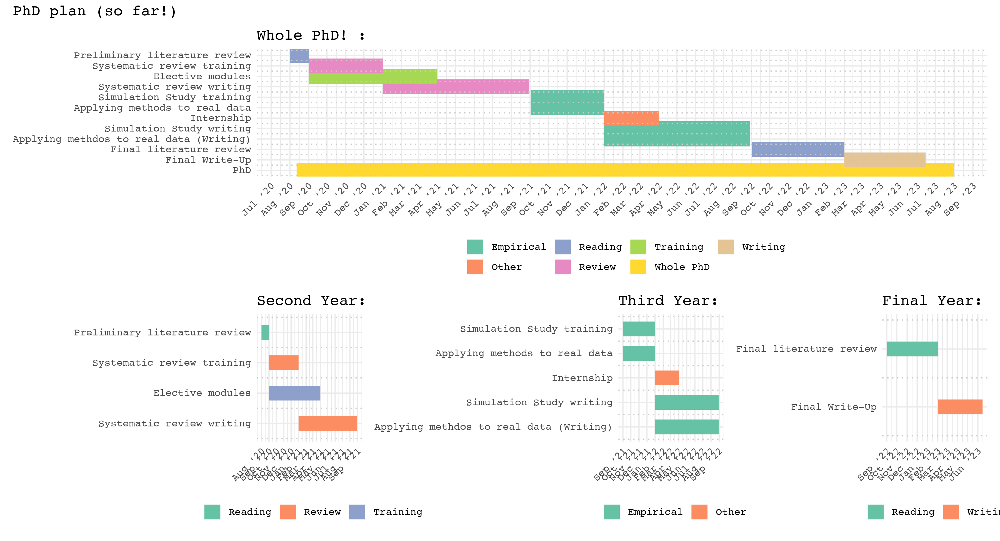

```{r setup, include=FALSE}
knitr::opts_chunk$set(echo = TRUE)
```

# Introduction / General theme: 

This document serves as an outline for the PhD. It is generated using an R Markdown script which can be found [here](https://github.com/NathanKhadaroo/PhD-Planning), alongside all previous versions of the document.

The general theme of the PhD is to explore the use of statistical modeling to address bias in citizen science generated data in the social sciences. 

I will first provide a non-exhaustive review of the literature, I will then outline some proposals for projects/papers that would constitute the substantive of the PhD thesis.


# Litterature review:

In this section I provide a brief non-exhaustive review of the literature on bias in citizen science data sets.

[Bird, et al (2014)](https://www.sciencedirect.com/science/article/pii/S0006320713002693?casa_token=WZPESRApp30AAAAA:0r80fYY8WgbOa63Zvch7ffZR67wkt6JmEV-fZPiRpyQd66SIlT083awYMy_q8YqZiTsQybOFLdQ) provide a detailed overview of statistical solutions to issues...

as well as a list of available R packages for their implementation.


[Senaratne, et al (2016)](https://www.tandfonline.com/doi/full/10.1080/13658816.2016.1189556?src=recsys) provide an overview of quality assessment methods for volunteered geographic information (a type of citizen science data which is highly prevalent in social science applications).

[Aceves-Buenoet al (2017)](https://esajournals.onlinelibrary.wiley.com/doi/full/10.1002/bes2.1336) provide a quantitative review of papers comparing citizen science data to some reference data. Specifically they seek to compare these papers own qualitative evaluation of the accuracy of the citizen science data and quantitative assessments, finding that authors can be overly optimistic in their qualitative assessments of their data. Furthermore, they find that what authors consider to be suffecient accuracy varies on a number of factors. Similarly to [Senaratne, et al (2016)](https://www.tandfonline.com/doi/full/10.1080/13658816.2016.1189556?src=recsys), they provide a list of metrics used to assess accuracy.


# Project proposal ideas:

In this section I outline the key components of my proposed thesis. 

The first component is a systematic review of citizen science projects which use statistical modeling to address bias. The aim is to gain a deep understanding of which biases are common (and commonly considered a problem), which approaches have been used to mitigate these problems, and to gain a quantitative understanding of the prevalence of various approaches. The understanding gained in this step should help inform the rest of the PhD.

The second component of the thesis is to evaluate the performance of the various 

## Systematic review:

#### Objective and motivation:

The first project I plan to undertake is a systematic review of citizen science projects which use statistical techniques to address bias in the data collection process. (*This could potentially also be my masters dissertation?*)

There is no existing systematic review of the ways statistically modeling has been applied to citizen science data sets across fields. This would therefore constitute a meaningful contribution to the literature. It would also allow me to delve deep into the literature and should inform later projects.

Prior review of bias in citizen science data so exist, for example [Bird, et al (2014)](https://www.sciencedirect.com/science/article/pii/S0006320713002693?casa_token=WZPESRApp30AAAAA:0r80fYY8WgbOa63Zvch7ffZR67wkt6JmEV-fZPiRpyQd66SIlT083awYMy_q8YqZiTsQybOFLdQ). However they are field specific (in this case biology), and do not follow a systematic approach. This exposes the findings to a higher risk of bias, and prevents the authors from making quantitative statements about the relative prevalence of various approaches.

#### How I will do it:

I will begin by looking at various protocols.

The Preferred Reporting Items for Systematic Reviews and Meta-Analyses framework or [PRISMA](http://www.prisma-statement.org) is often considered the gold standard, however there are concerns that its focus on the synthesis of medical evidence means it can be ill-adapted for non-intervention reviews.

An alternative would be the new Non-Interventional, Reproducible, and Open Systematic Reviews framework or [NIRO](https://osf.io/c9wer/), which emphasizes reproducibility and is designed with non-interventional reviews in mind.

Once I have settled on a protocol to follow, I will perform some initial scoping. Then, and critically before starting the final search for the review, I will pre-register my methodology and intentions on the [Open Science Framework](https://osf.io/u986c/).

Key aspects of studies which would have to be recorded would be the type of bias which is being addressed (Measurement error, representativeness, bias, various types of clustering, lack of absence data, etc), what modeling approach is being used (generalized linear models, hierarchical models (bayesian vs classical), additive models, geographically weighted regressing models, occupancy models (technically glm's), etc). 

It would also be useful to collect information on openness (whether the data and code are available,if the data was collected using a mobile app, was the software open source and does it have plans for sustainability, etc). A possible template for this would be the framework used in [Ostermann and Granell (2017)](https://onlinelibrary.wiley.com/doi/abs/10.1111/tgis.12195), who review 58 papers on the use of volunteered geographic information in the crisis management field and evaluate .

#### Pre-requisites: 
 
 - Studying PRISMA and NIRO.
 
 - Registering to the next university two-day workshop on systematic reviews.

 - Re-watching Prof Helen Worthington's methods@manchester video ['Intro to systematic reviews'](https://www.methods.manchester.ac.uk/themes/review-methods/systematic-reviews/).
 
 - Look into what resources and support I can get from he library, who I see have recently created a [new web page](https://subjects.library.manchester.ac.uk/systematic-reviews) dedicated to systematic reviews.


## Evaluating solutions:

#### Objective and motivation:

This project provides a large part of the empirical contribution of the thesis. It would necessarily take place after, and build upon, the systematic review, and would involve evaluating the performance of various solutions to bias in citizen science data (as identified in the systematic review) under various scenarios.

#### How I will do it:

A potential approach would be a simulation study using an agent based model to evaluate performance of various modeling approaches under different assumptions about underlying true distribution of the data, the clustering of observers, their accuracy, the type of data collection (for example presence only data vs presence/absence data) etc.

This could be used to look at a number of questions such as: 

- Do some modeling approaches work better when the target population is generated in certain ways (for example, scarce data vs abundant, etc (obviously yes, but do some model do well over many types...)? 

- Are certain modeling approaches useful only when the observation procedure follows different patterns. For example contributions being highly clustered (often as a power law) by contributors, tasks where high accuracy is widespread or not, different distributions of accuracy et cetera.

- How do models account for heterogeneity in contributors (both in quantity and quality)? Could bayesian hierarchical models use super-contributors, who are known to be more accurate, to generate informative priors for contributors who are less active/precise?

#### Pre-requisites: 

- Gaining an understanding of the modeling approaches identified in the systematic reviews.

- Learning about what is best practice for running simulation studies.

- Gaining a more in-depth understanding of how to use agent based models to simulate the data collection procedure.

- A good understanding of a (Bayesian?) framework with which to evaluate and compare various approaches (A highly recommended resource is [McElreath (2020)](https://xcelab.net/rm/statistical-rethinking/). This is in R and Stan, though code for the book is also available in Julia which could be good practice if I choose to code the agent based model in Julia).

- Occupancy modeling *appears* to be the most prominent approach in species monitoring, it could be fruitful to audit a biology module on this, though I can't see any. Additionally [MacKenzie et al (2017)](https://www-sciencedirect-com.manchester.idm.oclc.org/book/9780124071971/occupancy-estimation-and-modeling) looks like a useful overview.

- Small area estimation is quite common with crowd-sourced data (could occupancy be considered a special case of this??). I understand there is a NCRM course on the r sae package but I have been told it might not be worth attending, a colleague who attended previously has kindly sent me the slides.

## Developing a unified framework for modelling bias is citizen social science:

#### Objective and motivation:
#### How I will do it:
#### Pre-requisites: 


## Elective module choice:

It is fairly difficult to get detailed information on most courses.

Some potential takes could be:

- Longitudinal data analysis with Alex Cernat (Alex is fantastic and most citizen science data has a longitudinal aspect).

- Possibly Complex Survey Designs and Analysis though I'm not sure of the software used, and the MARD module by the same lecture was underwhelming and seemed outdated (the focus was mainly on the now quite stale debate between qualitative and qualitative approaches to social research, no mention of currently active debates such as those surrounding causal inference or reproducibility).

## Ethics:

I am committed to making all the output from the PhD freely available and as reproducible as possible. This involves exclusively using scripted open-sourced software for analysis, making data used open whenever possible. I also aim to pre-register any analysis I will be undertaking (including the systematic review) on my [Open Science Framework page](https://osf.io/u986c/).

## Bibliography: 

[Aceves-Bueno, E., Adeleye, A. S., Feraud, M., Huang, Y., Tao, M., Yang, Y., & Anderson, S. E. (2017). The accuracy of citizen science data: a quantitative review. Bulletin of the Ecological Society of America, 98(4), 278-290.](https://esajournals.onlinelibrary.wiley.com/doi/full/10.1002/bes2.1336)

[Bird, T.J., Bates, A.E., Lefcheck, J.S., Hill, N.A., Thomson, R.J., Edgar, G.J., Stuart-Smith, R.D., Wotherspoon, S., Krkosek, M., Stuart-Smith, J.F. and Pecl, G.T. (2014). Statistical solutions for error and bias in global citizen science datasets. Biological Conservation, 173, 144-154.](https://www.sciencedirect.com/science/article/pii/S0006320713002693?casa_token=WZPESRApp30AAAAA:0r80fYY8WgbOa63Zvch7ffZR67wkt6JmEV-fZPiRpyQd66SIlT083awYMy_q8YqZiTsQybOFLdQ)

[Elliott, K. C., & Rosenberg, J. (2019). Philosophical foundations for citizen science. Citizen Science: Theory and Practice, 4(1).](https://theoryandpractice.citizenscienceassociation.org/article/10.5334/cstp.155/)

[MacKenzie, D. I., Nichols, J. D., Royle, J. A., Pollock, K. H., Bailey, L., & Hines, J. E. (2017). Occupancy estimation and modeling: inferring patterns and dynamics of species occurrence. Elsevier.](https://www-sciencedirect-com.manchester.idm.oclc.org/book/9780124071971/occupancy-estimation-and-modeling)

[McElreath, R. (2020). Statistical rethinking: A Bayesian course with examples in R and Stan. CRC press.](https://xcelab.net/rm/statistical-rethinking/)

[Ostermann, F. O., & Granell, C. (2017). Advancing science with VGI: Reproducibility and replicability of recent studies using VGI. Transactions in GIS, 21(2), 224-237.](https://onlinelibrary.wiley.com/doi/abs/10.1111/tgis.12195)

[Pickering, J.S., Topor, M., et al (2020). Non-Interventional, Reproducible, and Open (NIRO) Systematic Review Guidelines v0.1](https://osf.io/c9wer/)

[Senaratne, H., Mobasheri, A., Ali, A. L., Capineri, C., & Haklay, M. (2017). A review of volunteered geographic information quality assessment methods. International Journal of Geographical Information Science, 31(1), 139-167.](https://www.tandfonline.com/doi/abs/10.1080/13658816.2016.1189556)

[Wijewardhana, U. A., Meyer, D., & Jayawardana, M. (2020). Statistical models for the persistence of threatened birds using citizen science data: A systematic review. Global Ecology and Conservation, 21, e00821.](https://www.sciencedirect.com/science/article/pii/S2351989419304792) 

## Appendix:




